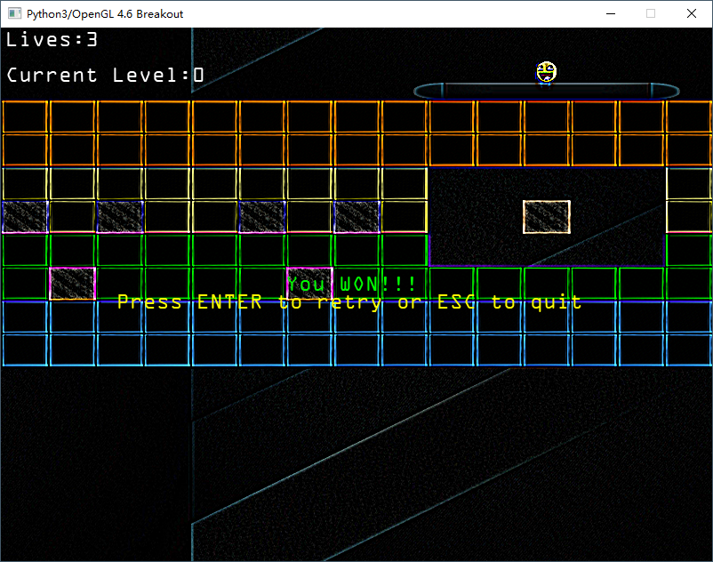

# Python-Breakout
Python3 version of Breakout.

Adapted form the breakout game in chapter 7 (in_practice) of https://github.com/JoeyDeVries/LearnOpenGL

And I also migrated all codes to use OpenGL 4.6.

All codes tested on Windwos 10 and Python 3.10.6.

If you enjoy the repository, please give my repo a star ⭐ ⬆️. 

## Requirements
Python needs >= 3.9
* glfw
* PyOpenGL
* PyGLM
* Pillow
* freetype-py
* pygame (to play mp3/wav files)

## Screenshot

